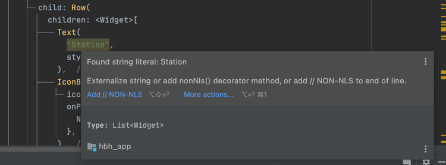
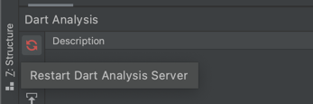

# string_literal_finder

Simple command line application and **analyzer plugin** to find non translated string literals
in dart code. Makes sure when localizing your app that you externalized all strings.

Tries to be smart about ignoring specific strings.

## Installation & Usage

```console
$ pub global activate string_literal_finder
$ pub global run string_literal_finder --path=example
2020-08-08 15:11:31.273227 INFO string_literal_finder - Found 1 literals:
2020-08-08 15:11:31.274592 INFO string_literal_finder - lib/example.dart:17:30 'not translated'
Found 1 literals in 1 files.
```

## Integration with IDE analyzer

It is possible to get the warnings directly in your IDE by
configuring `string_literal_finder` as a analyyer plugin.



1. Install dev dependency
    ```shell
    flutter pub add --dev string_literal_finder

    # The above will add the following to your pubspec.yaml
    dev_dependencies:
      string_literal_finder: ^1.0.0 # Make sure to use the latest version.
    ```
2. Configure `analysis_options.yaml`
    ```yaml
    analyzer:
      plugins:
        - string_literal_finder

    ```
3. Restart your analyser.
    


## Example

The following dart file:

```dart
import 'package:string_literal_finder_annotations/string_literal_finder_annotations.dart';
import 'package:logging/logging.dart';

final _logger = Logger('example');

void exampleFunc(@NonNls String ignored, String warning) {}

void main() {
  exampleFunc('Hello world', 'not translated');
  _logger.finer('Lorem ipsum');

  final testMap = nonNls({
    'key': 'value',
  });
}
```

will result in those warnings:

```shell
$ dart bin/string_literal_finder.dart --path=example
2020-08-08 14:38:47.800339 INFO string_literal_finder - Found 1 literals:
2020-08-08 14:38:47.801934 INFO string_literal_finder - lib/example.dart:17:30 'not translated'
Found 1 literals in 1 files.
$ 
```

# Ignored literal strings

* Any argument annotated with `@NonNls` or `@NonNlsArg()`
* Anything which is parsed into the `nonNls` function.
* Anything passed to `logging` library `Logger` class.
* Any line with a line end comment `// NON-NLS`
