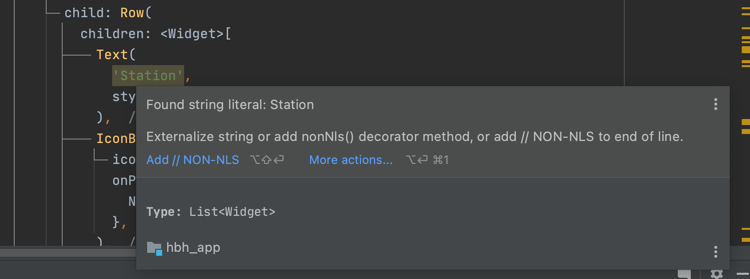
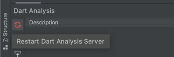

[](https://pub.dev/packages/string_literal_finder/)
[](https://pub.dev/packages/string_literal_finder/)
[](https://pub.dev/packages/string_literal_finder/score)
[](https://codecov.io/gh/hpoul/string_literal_finder)

# string_literal_finder

Finds string literals in Dart code which should have been externalized for
translation. Useful when localizing an app, and as a CI check that keeps new
hardcoded strings from creeping back in.

It ships two front ends over the same analysis:

* a **command line tool**, for CI, and
* an **analyzer plugin**, for warnings directly in your IDE.

Both apply the same rules and read the same configuration.

## Command line

```shell
dart pub global activate string_literal_finder
dart pub global run string_literal_finder --path=lib
```

```
lib/example.dart:17:30 'not translated'
Found 1 literal in 1 file.
{
  "stringLiterals": 1,
  "stringLiteralsFiles": 1,
  "filesAnalyzed": 1,
  "filesSkipped": 0,
  "filesWithoutLiterals": 0
}
```

Exit codes:

| code | meaning |
| ---- | ------- |
| 0    | nothing to report |
| 1    | literals were found which the configured gate does not allow |
| 2    | the command line could not be understood |
| 70   | something went wrong during analysis |

## Adopting this on a project that already has literals

A real code base has thousands of string literals, and a check that fails on
day one gets switched off. Record the current state once, commit it, and gate
on additions:

```shell
# once, and commit the result
dart run string_literal_finder --path=lib \
    --baseline=string_literals_baseline.json --write-baseline

# in CI
dart run string_literal_finder --path=lib \
    --baseline=string_literals_baseline.json
```

The second command exits 0 while nothing new appears, and exits 1 listing only
the literals that are not in the baseline. As strings get externalized, re-run
`--write-baseline` to shrink it; the run tells you how many recorded entries
have gone.

Baseline entries are keyed by file and by the literal *as written*, not by line
number, so reformatting, moving code within a file, or editing an unrelated
line will not make the check fail. Adding a second copy of a literal to a file
that already had one is still reported.

`--max-literals=<n>` is the cruder alternative if you would rather track a
single number than a file.

### Machine-readable output

`--format=json` writes every finding to stdout, for CI annotations:

```json
{
  "ok": false,
  "metrics": { "stringLiterals": 1, "...": "..." },
  "literals": [
    {
      "path": "example.dart",
      "line": 17, "column": 30, "endLine": 17, "endColumn": 46,
      "literal": "'not translated'",
      "value": "not translated"
    }
  ]
}
```

Diagnostics go to stderr, so stdout stays parseable.

### Speed

Resolving Dart source is ~97% of a run. `--cache-dir` keeps the analyzer's
linked summaries between runs. Measured best-of-three on an M-series Mac:

| corpus | v1.5.0+1 | now | now, warm cache |
| ------ | -------- | --- | --------------- |
| Flutter app, 146 files in `lib/` | 16.0s | 12.6s | **5.4s** |
| Flutter app, 117 files in `lib/` | 16.1s | 14.5s | **4.8s** |

The cache is 70–95 MB for a Flutter app and is safe to cache in CI:

```yaml
- uses: actions/cache@v4
  with:
    path: .dart_tool/string_literal_finder
    key: slf-${{ hashFiles('pubspec.lock') }}
- run: dart run string_literal_finder --path=lib
        --cache-dir=.dart_tool/string_literal_finder
        --baseline=string_literals_baseline.json
```

## Reducing noise

Out of the box the tool reports *every* literal it cannot prove is
non-translatable. On a real Flutter application that is roughly eight findings
for every genuinely user-visible string; the rest are map keys, asset
extensions, `switch` cases and punctuation.

The best fix is to mark them at the source, with the suppressions below — that
is precise, and it documents intent. Where that is too much work up front,
these filters trade recall for signal. **They are all off by default**, because
a tool that silently hides a real untranslated string is worse than a noisy
one.

| flag | effect on a real 2724-finding corpus | risk |
| ---- | ------------------------------------ | ---- |
| `--ignore-symbols` | −16% | low: drops literals with no word in them (`''`, `'/'`, `'0'`, `'2026-08-12'`) and pure substitutions (`'$error'`). Keeps `' $unit'` and `'$a – $b'` — see below |
| `--min-length=<n>` | −20% at `n=2` | blunter version of the same idea; also drops `'OK'`, `'No'`, `'de'` |
| `--ignore-pattern=<regex>` | depends | yours to choose; repeatable |
| `--prose-only` | −67% | **high** — also drops `'Cancel'`, `'Back'`, `'Hidden'`. Use it to triage the biggest wins, not as a gate |

Start with `--ignore-symbols`. Measure the rest against your own code with
`--format=json` before trusting them.

`--ignore-symbols` deliberately **keeps** an interpolation whose literal text
is letterless, such as `' $unit'`, `'$a – $b'`, `'${w} × ${h}'` or
`'$count $noun${count == 1 ? '' : 's'}'`. They look like punctuation by any
simple measure, but each is a template whose separator, ordering or
pluralisation can differ by locale — which is among the most valuable things
this tool finds. Only interpolations with *no* literal text at all (`'$error'`)
are dropped.

## Integration with the IDE analyzer



1. Add the plugin to `analysis_options.yaml`. Note this is a **top-level**
   `plugins:` key — the older `analyzer: plugins:` form is the legacy plugin
   mechanism and will not load this plugin.

    ```yaml
    plugins:
      string_literal_finder: ^2.0.0
    ```

    A local path works too:

    ```yaml
    plugins:
      string_literal_finder:
        path: ../string_literal_finder
    ```

2. Restart your analyzer.

    

Requires Dart 3.11 or newer. `dart analyze` runs analyzer plugins;
`flutter analyze` does not.

## Ignoring literals

* Any argument annotated with `@NonNls` or `@NonNlsArg()`
* Anything passed to the `nonNls()` function
* Anything in a function, method or class annotated with `@NonNls`
* Anything passed to the `logging` package's `Logger`
* Arguments to annotations, and `import` / `part` / `part of` URIs
* Constructor arguments of `Uri`, `RegExp`, `Exception`, `Error`,
  `AssetImage`, `RouteSettings`, `ValueKey` and `MethodChannel`
* Any line with a trailing `// NON-NLS` comment
* Files matching `exclude_globs`, and anything ending in `.g.dart`

The annotations live in a separate, dependency-free package:

```shell
dart pub add string_literal_finder_annotations
```

`// NON-NLS` applies to the line the literal *ends* on. For a call spread over
several lines, put the comment on the line of the literal itself, or annotate
the parameter instead.

### exclude_globs

```yaml
string_literal_finder:
  exclude_globs:
    - '_tools/**'
    - '**/*.freezed.dart'
```

Globs are relative to the directory holding `analysis_options.yaml`. Both the
plugin and the command line read this; pass `--no-analysis-options` to the CLI
to ignore it.

## Example

```dart
import 'package:string_literal_finder_annotations/string_literal_finder_annotations.dart';
import 'package:logging/logging.dart';

final _logger = Logger('example');

void exampleFunc(@NonNls String ignored, String warning) {}

void main() {
  exampleFunc('Hello world', 'not translated');
  _logger.finer('Lorem ipsum');

  final testMap = nonNls({
    'key': 'value',
  });
}

@NonNls
String ignoreFunction() {
  // all strings in this function will be ignored.
  return 'foo';
}
```

Only `'not translated'` is reported.
